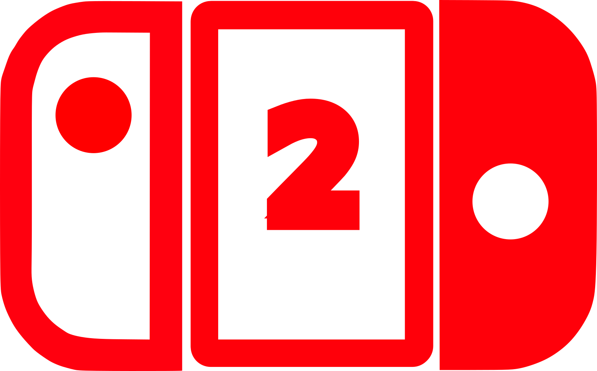
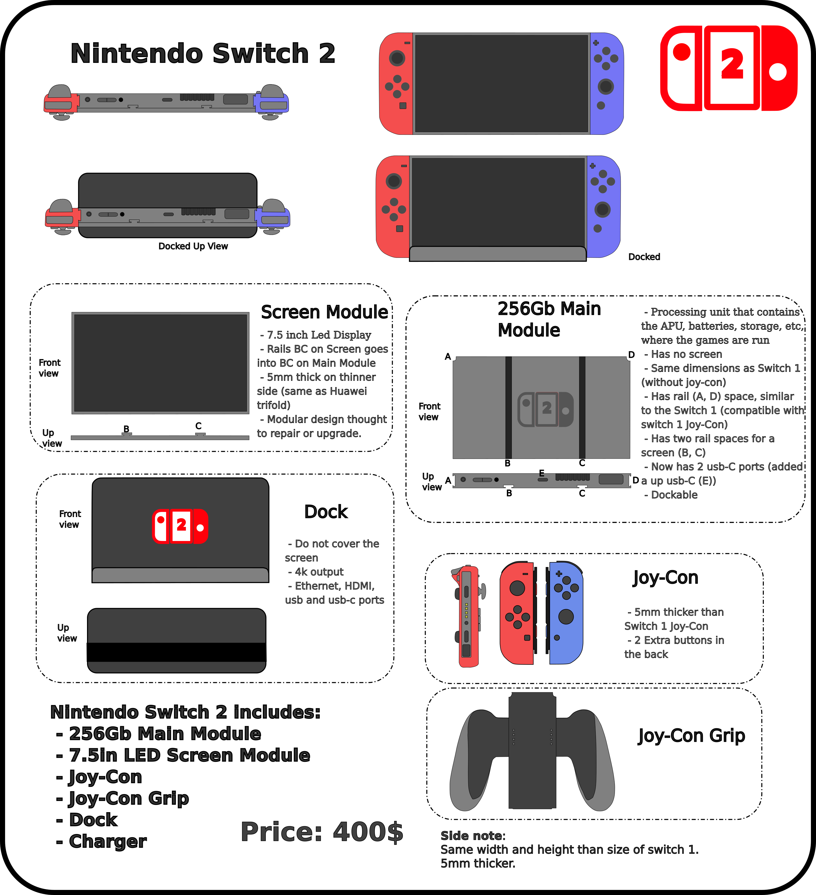
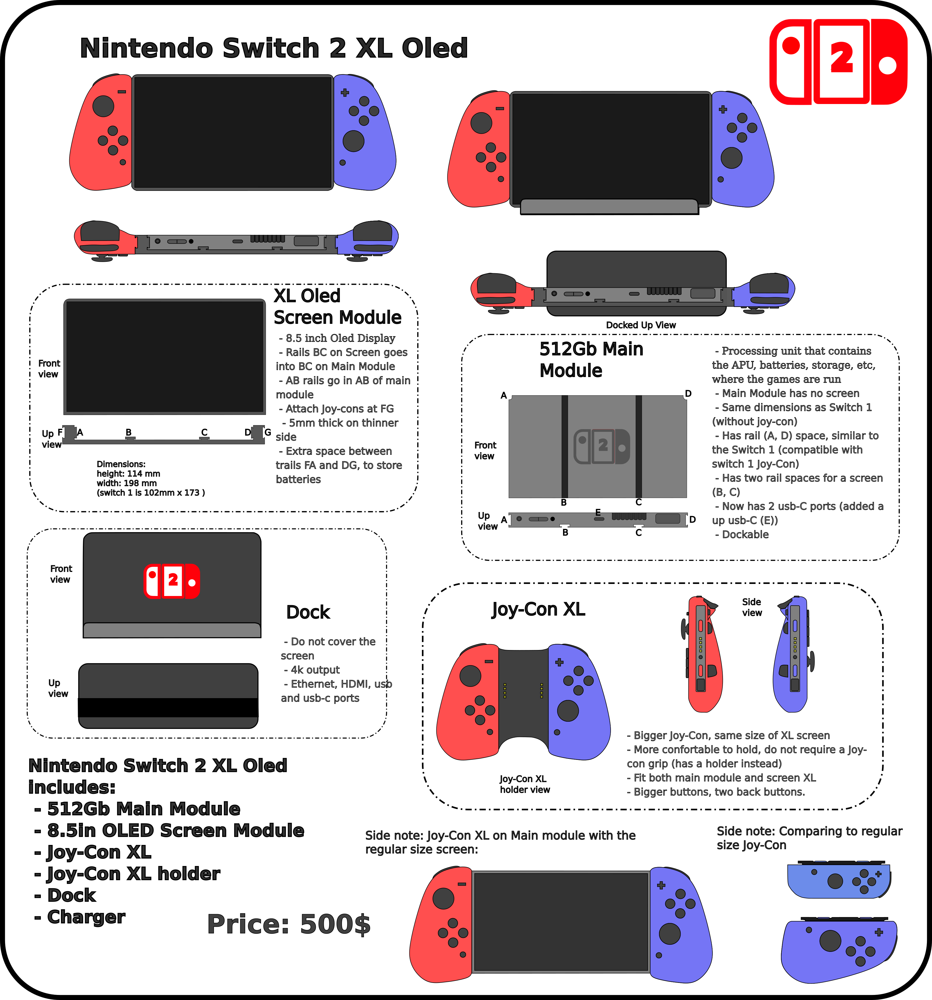
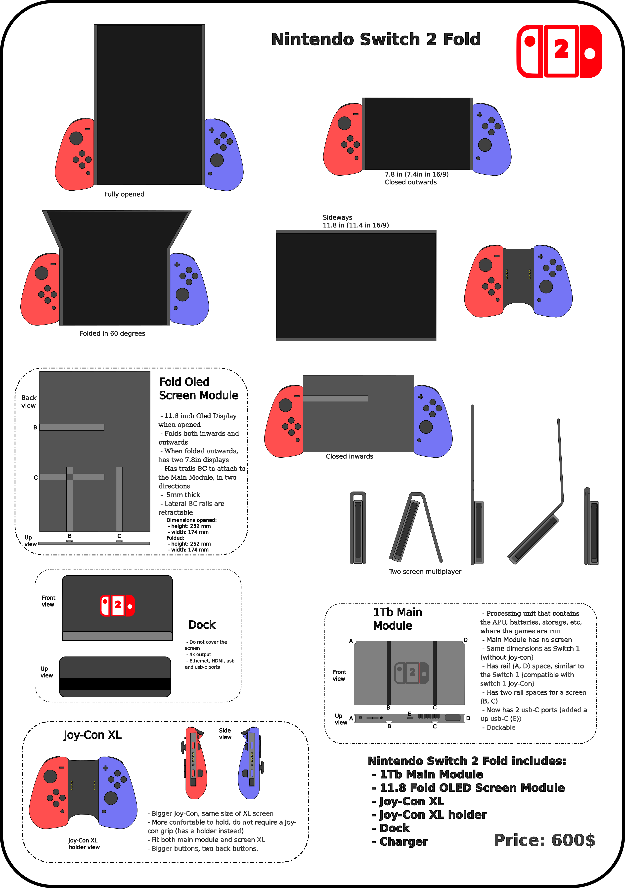
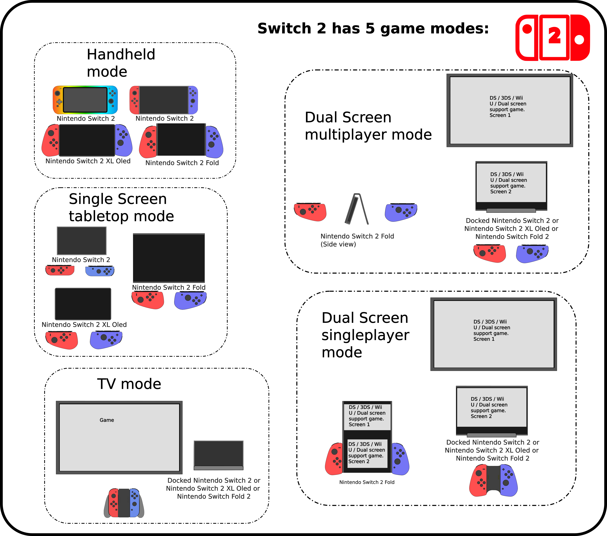

# My-Switch-2-sketches

   

In my concept for the Nintendo Switch 2, let us expand the modular concept of the switch, in order to be an hybrid console that switches in more ways, being the next iteration of the switch.

Now, not only the controller are detachable, but also the screen. There is a main module is a switch sized block that do not contain a screen, but rails space to you to attach a screen (and also the controllers).

So, new possibilities:
- There are several different screens to use, a cheaper one, other with controllers, Oled, XL, even fold screen. The cheaper would be more acessible, and you could upgrade along the time.
- Use the one that better fits your needs. If you want to carry it, and in other day you know you gonna play with friends in tabletop, use a bigger one. Then you want a single player with higher quality oled screen. You just switch. Keeping switching

Also, the dock do not cover the screen. Combined with the screen module, and dual screen games (DS/3DS Virtual Console), there are now 5 gaming modes (2 more than 3 game modes on switch).
The old ones:
-Handheld
-Single screen tabletop
-TV
But now it is possible to:
- Double screen multiplayer: Use either the Switch 2 Fold to fold the screen in two, so every player has its own screen. (For instance, dont need split screen in mario kart). This mode can also be on tv, where 1 player plays on the TV and the other on the switch 2 screen on dock.
- Double Screen Singleplayer: Use the switch 2 fold to get 2 screens and play like the DS/3DS/Wii U, with now a Virtual Console for them. Some other games released on siwtch 2 can be used in the dual screen mode, optionally. And also, it can be played in this mode with a TV and a docked switch 2 with screen.

There is 4 opions of SKU:
-300$ Nintendo Switch 2 Lite: 128Gb main module, and a screen-con (module that has screen and controlers in a single block). they attach and work as a switch 1 lite (slighly bigger, though). With only the content that comes in the box, only handheld mode. If you upgrade with dock, could would like the others.

   

-400$ Nintendo Switch 2: 256Gb main module, with regular joy-con and grip. But now with a screen module where you attach to the main module. Allows handheld, tabletop, TV, dual screen multiplayer on a TV and dock, and dual screen singleplayer with TV and dock.

   

-500$ Nintendo Switch 2 XL Oled: 512Gb, Bigger screen 1 inch bigger. It kinda embraces the main module with the screen, and to get to same sizes, we use a Joy-Con XL, more ergonomic, bigger, and much better to play detached with a friend (because regular joy-con is too small for many hands).

   

-600$ Nintendo Switch 2 Fold: 1Tb main module. A big 11.8 screen that folds in two ways.
When closed, work like a regular switch screen, and is easy to carry.
When oppened at a certain angle, you can play like a DS, 3DS ou even WiiU, even out of the TV.
And also, attach in horizontal rails, and you could use as a big screen, put it on dock, and you have a second screen for dual screen play.

   

You can buy one of them, then get acessories to transform your switch 2 as capable to switch modes as you wish.

A visualization of all game modes:

   

